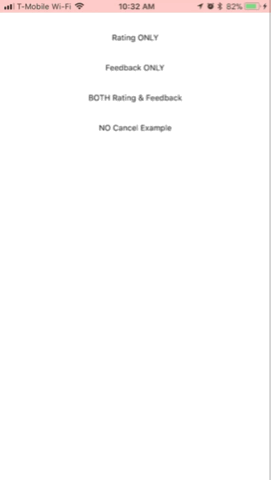
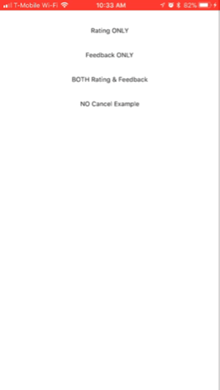

[](http://www.appcelerator.com/titanium/)
[](http://www.appcelerator.com/alloy/)
[](http://choosealicense.com/licenses/apache-2.0/)

# ti.appraise
Titanium Alloy Widget - Add your own custom Rating or Feedback Component (or both) to your app.

The purpose of this widget is to provide a simple widget to use for prompting the user for a 1-5 Star Rating, or for feedback, or even both!






### Requirement
- [x] Titanium SDK
  
#
  
### Usage
* Download the latest release of the widget.
* Unzip the folder to your project under app/widgets/ti.appraise
* Add the widget as a dependency to your app/config.json
* IF you want to show an app icon (like Apple's) then create/put an icon in your project.  The way Apple packages the App Icons into assets, you cant reference that icon and will have to provide an additional copy to use.
* Create a var to hold the reference to the Widget.
```javascript
var onlyRate = Alloy.createWidget("ti.appraise", {
  submit: submit,
  cancel: cancel,
  ratingRequired: true,
  feedbackRequired: false,
  minRateRequiringFeedback: 3,
  allowCancel: true,
  image: '/appraise_appicon.png'
});
```
* 'open' when the time is appropriate
```javascript
onlyRate.getView().open();
```
  
#
  
### Methods & Configurable Options
All are 'optional'.  See below for default values.
## *submit*
{function}  
provide a callback function you want called upon a successfull submit
  
## *cancel*
{function}  
provide a callback you want called upon hitting the cancel button
  
## *ratingRequired*
{BOOL}      (default = true)  
determines whether user is shown rating mechanism
  
## *feedbackRequired*
{BOOL}      (default = true)  
determines whether user is shown feedback mechanism
  
## *minRateRequiringFeedback*
{INTEGER 1-4}      (default = -1, which disables this feature)  
with this value set, if the user rates your app a number equal to that or lower, then the user is forced to enter feedback to justify the 'low' rating.
> **NOTE**: In order to use this you *MUST* set ratingRequired = true
  
## *allowCancel*
{BOOL}      (default = true)  
when set to false, the 'cancel' button is completely removed and the user cannot exit/cancel the rating/feedback.  I can't think of any good UX reason to use this, but it is there should you need it.
  
## *image*
{STRING}    (default = no image)
if using this you must provide a path to a separate icon and cannot use one of the App Icons created for the app (explained above).
  
#
  
### Examples
#### Rating Only
```javascript
var onlyRate = Alloy.createWidget("ti.appraise", {
  submit: submit,
  cancel: cancel,
  ratingRequired: true,
  feedbackRequired: false,
  minRateRequiringFeedback: 3,
  allowCancel: true,
  image: '/appraise_appicon.png'
});
onlyRate.getView().open();
```

#### Feedback Only
```javascript
var onlyFeedback = Alloy.createWidget("ti.appraise", {
  submit: submit,
  cancel: cancel,
  ratingRequired: false,
  feedbackRequired: true,
  allowCancel: true,
  image: '/appraise_appicon.png'
});
onlyFeedback.getView().open();
```

#### Both Rating & Feedback
```javascript
var bothRateAndFeedback = Alloy.createWidget("ti.appraise", {
  submit: submit,
  cancel: cancel,
  ratingRequired: true,
  feedbackRequired: true,
  minRateRequiringFeedback: 100,
  allowCancel: true,
  image: '/appraise_appicon.png'
});
bothRateAndFeedback.getView().open();
```

#### Rating w/ NO Cancel Button Allowed
```javascript
var onlyRate = Alloy.createWidget("ti.appraise", {
  submit: submit,
  cancel: cancel,
  ratingRequired: true,
  feedbackRequired: false,
  minRateRequiringFeedback: 3,
  allowCancel: false,
  image: '/appraise_appicon.png'
});
onlyRate.getView().open();
```

#### config.json
```javascript
"dependencies": {
        "ti.appraise": "1.0"
    }
```
  
#
  
> **NOTE**: This was designed for Enterprise Apps (where Apple's default Rating system and TestFlight are not available).  I seriously doubt Apple would allow this through the store.  If you are waiting to use the native SKStoreReviewController, I suggest you use the one from Hans Knoechel ([@hansemannnn](https://twitter.com/hansemannnn)) here-> https://github.com/hansemannn/titanium-review-dialog
  
#
  
### Author
* Adam Armstrong ([@adamtarmstrong](https://twitter.com/adamtarmstrong))
  
#
  
### License
Apache 2.0
  
#
  
Code contributions are greatly appreciated, please submit a new [pull request](https://github.com/hyperloop-modules/ti.hockeyapp/pull/new/master)!
